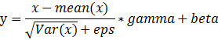

nn.BatchNorm1d();nn.BatchNorm2d();nn.BatchNorm3d()

```python
import torch.nn as nn
batch_norm = nn.BatchNorm2d()
```

数学公式：


$ y=\displaystyle\frac{x-mean(x)}{\sqrt{Var(x)}+eps}*gamma+beta $

$ mean(x)$：x的平均值
$\sqrt{Var(x)}$: x的标准差 
eps: 为了计算稳定性在分母中加的一个值（确保分母不为零？）
momentum: 一个可以学习的倍率参数
beta: 一个可以学习的偏差参数

以BatchNorm2d为例:
    作用：对所有batch的每个通道进行归一化

参数：
    
```python
import torch.nn as nn
batch_norm = nn.BatchNorm2d(num_features,eps=1e-05,momentum=0.1,affine=True,track_running_stats)
```
num_features: 指输入特征的数量，即通道数
eps: 为了计算稳定性在分母中加的一个值（确保分母不为零？）
momentum: 一个可以学习的倍率参数
beta: 一个可以学习的偏差参数
affine: (bool,"True"),当设置为True时，该模块有可学习的仿射参数，即可学习的momentum和beta
track_running_stats：(bool,"True"),当为True时，该模块跟踪运行平均值和偏差